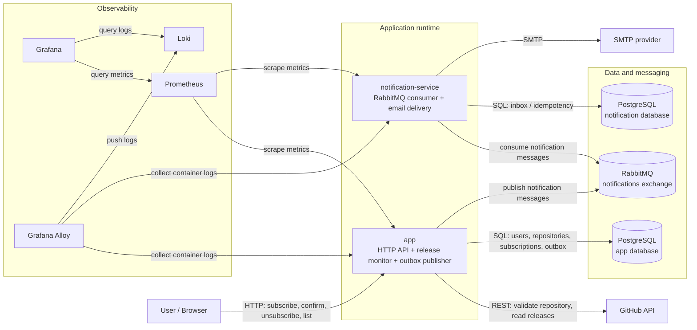
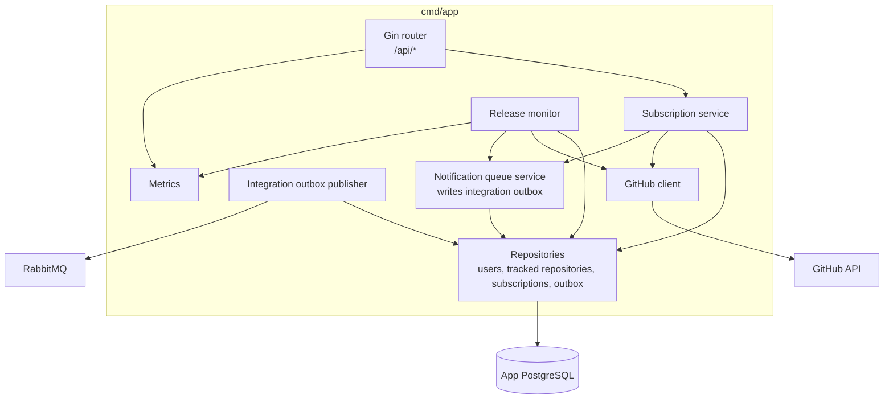
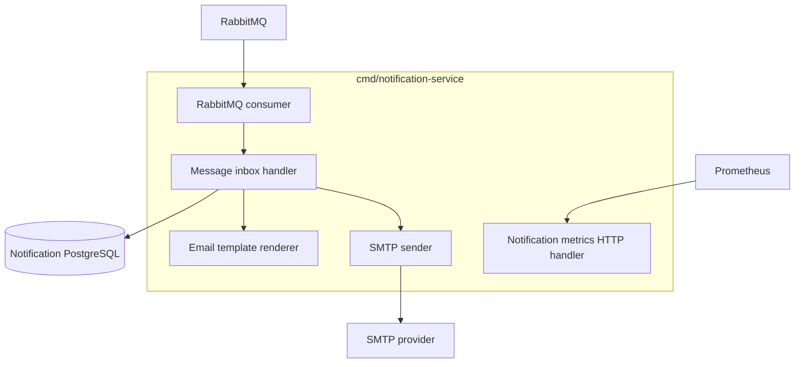
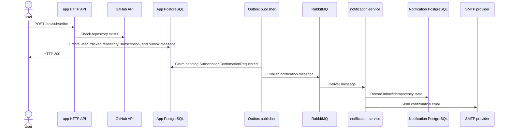
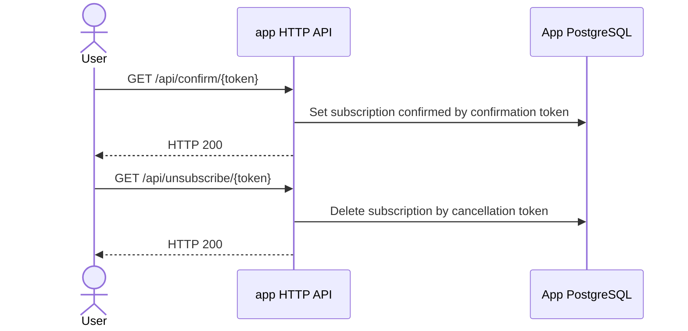
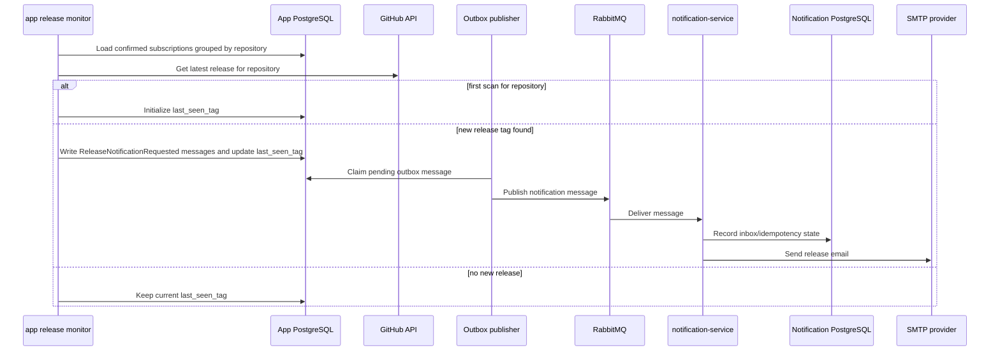

# Application Architecture

GitHub Release Notifier consists of two application services:

- `app`: public HTTP API, subscription logic, release monitor, and integration outbox publisher.
- `notification-service`: RabbitMQ consumer that renders notification emails and sends them through SMTP.

## Container View

## App Components

## Notification Service Components

## Subscribe Flow

## Confirm And Unsubscribe Flows

## Release Notification Flow

## Persistence Boundaries

- `app` owns users, tracked repositories, subscriptions, and integration outbox tables.
- `notification-service` owns notification inbox/idempotency state.
- RabbitMQ is the asynchronous boundary between notification-producing logic and email delivery.
- PostgreSQL is a shared server in Docker Compose, but the app and notification service use separate migration sets and logical databases.

## Reliability Notes

- Subscription confirmation emails and release notification emails are written to the app database before publishing.
- The integration outbox publisher claims pending outbox messages and publishes them to RabbitMQ.
- The notification consumer records incoming messages in its inbox store before delivery, so repeated RabbitMQ deliveries can be handled idempotently.
- The release monitor stores `last_seen_tag` per tracked repository to avoid repeatedly notifying for the same release.
- Prometheus scrapes `app` and `notification-service`; Alloy collects logs from the same two application containers and pushes them to Loki.
