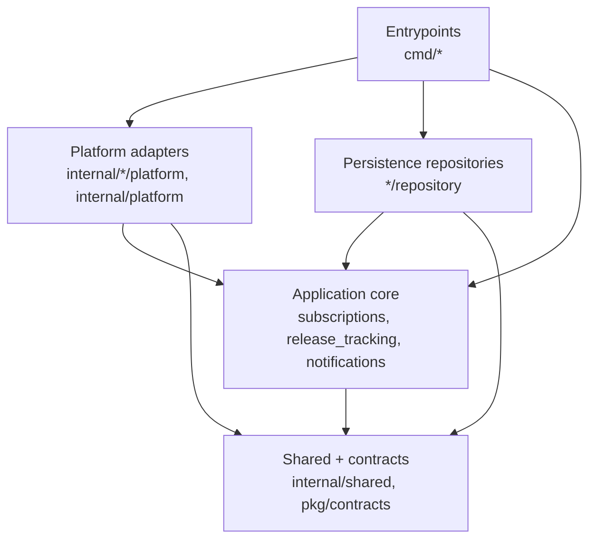

# Layering Rules

This document defines the intended dependency direction for the project. The rules are enforced by architecture tests in `internal/architecture`.

## Layers

### Entrypoints

Packages:

- `cmd/app`
- `cmd/notification-service`

Entrypoints compose the application. They may depend on application services, repositories, platform adapters, configuration, logging, metrics, and external libraries.

### Application Core

Packages:

- `internal/app/subscriptions`
- `internal/app/release_tracking`
- `internal/app/notifications`
- `internal/notification/notifications`

Application core packages contain business workflows and domain-facing interfaces. They should not depend on transport or infrastructure implementation details such as HTTP routers, RabbitMQ clients, SMTP clients, SQL drivers, or config loading.

Allowed dependencies include:

- standard library packages;
- domain packages inside the same bounded context;
- shared errors/types;
- `pkg/contracts/*` message contracts;
- metrics abstractions where the current code uses them;
- narrow application-owned value types required by existing outbox integration.

### Persistence Repositories

Packages:

- `internal/app/subscriptions/repository`
- `internal/app/release_tracking/repository`
- `internal/notification/notifications/repository`

Repository packages implement persistence. They may depend on `database/sql` and `internal/platform/db`, but they must not depend on HTTP, RabbitMQ, SMTP, or service entrypoints.

### Platform Adapters

Packages:

- `internal/app/platform/http`
- `internal/app/platform/github`
- `internal/app/platform/messaging`
- `internal/app/platform/metrics`
- `internal/notification/platform/mail`
- `internal/notification/platform/messaging`
- `internal/notification/platform/metrics`
- `internal/platform/*`

Platform adapters integrate with frameworks, external services, messaging, databases, configuration, logging, and metrics. They may depend inward on application interfaces and shared contracts, but core business packages should not depend back on adapter implementations.

### Shared And Contracts

Packages:

- `internal/shared`
- `pkg/contracts/*`

Shared packages and external message contracts should stay independent from application internals, platform adapters, and service entrypoints.

## Dependency Direction

The direction is intentionally one-way: core packages define workflows and interfaces, while repositories and adapters implement infrastructure details around them.

## Enforced Rules

Architecture tests enforce these constraints for production Go files:

- application core does not import HTTP frameworks, RabbitMQ, SMTP, SQL, config, repository packages, or concrete transport adapters;
- repository packages do not import HTTP frameworks, RabbitMQ, SMTP, or entrypoint packages;
- `internal/shared` does not import application, notification, platform, or entrypoint packages;
- `pkg/contracts/*` does not import internal application or platform packages;
- notification-service internals do not import app-service internals;
- app-service internals do not import notification-service internals.

If a rule needs to change, update this document and the architecture test in the same commit.
